# Autogui: 自動GUIバインディングライブラリ

[English](readme.md) | 日本語

AutoguiはJava/SwingのGUIアプリケーションをplain-old Javaオブジェクトから作り出すライブラリです。
基本的な仕組みはリフレクションAPIを通じて与えられたオブジェクトのクラス構造を解析し、
クラスに定義されたプロパティとアクションに対応したSwingベースのコンポーネントを組み合わせて作り出します。

## ライセンス

[Apache License v2](LICENSE.txt)

## ソースからのビルド

[GitHubプロジェクトページ](https://github.com/ppp-kohe/autogui.git)

```bash
git clone https://github.com/ppp-kohe/autogui.git
cd autogui
```

このプロジェクトはビルドのために[apache-maven](http://maven.apache.org)を利用し、Javaの下記のバージョンに依存します。

* 1.7- : Java 21以降
* 1.2- : Java 11以降
* -1.1x : Java 8以降


```bash
mvn package
  # このコマンドは target/autogui-1.7.jar を生成します。
```
本プロジェクトの主要部分はJDKクラス以外の他のライブラリに依存しません。
`src/main/java`にあるソースファイル(及び`src/main/resources`にあるリソース)を手動でコンパイルすることもできます。

## Mavenの利用

本ライブラリをapache-mavenのプロジェクトで利用する場合は、`pom.xml`ファイルに下記の`dependency`セクションを挿入してください。

```xml
    <dependency>
        <groupId>org.autogui</groupId>
        <artifactId>autogui</artifactId>
        <version>1.7</version>
    </dependency>
```

本ライブラリはMaven Central Repositoryから取得できます: [org.autogui:autogui](https://search.maven.org/artifact/org.autogui/autogui/)

[](https://maven-badges.herokuapp.com/maven-central/org.autogui/autogui)

## APIドキュメント

* [最新版](https://www.autogui.org/docs/apidocs/latest/index.html)

## 簡単な利用方法の説明: jshellでのサンプル

本ライブラリはJava 9以降にJDKに導入された標準のREPLツールである`jshell`コマンド上で利用することができます。
利用するには、まず、本ライブラリのjarファイルをクラスパスに含める必要があります。
`jshell`では、`/env -class-path <path/to/jar>`コマンドを実行することで可能です。
`jshell`コマンドで起動したら、下記のコードの`jshell>`プロンプト行以降を貼り付けることで試すことができます。(JDK, Git, Mavenがインストールされている環境を前提としています。)


```
$ git clone https://github.com/ppp-kohe/autogui.git
$ cd autogui
$ mvn package
$ jshell
|  Welcome to JShell -- Version 21.0.3
|  For an introduction type: /help intro

jshell> 
class Hello {
   String value;
   void action() {
      System.out.println(value);
   }
}

/env -class-path target/autogui-1.7.jar

import org.autogui.swing.*
Hello h = new Hello();
AutoGuiShell.showLive(h)

```

上記のコードはまず`Hello`クラスを定義します。`Hello`クラスは1つのインスタンスフィールドとメソッドを定義しています。
その後、[`org.autogui.swing.AutoGuiShell.showLive(Object)`](https://www.autogui.org/docs/apidocs/latest/org.autogui/org/autogui/swing/AutoGuiShell.html#showLive(java.lang.Object)) の呼び出しを行います。これにより引数のオブジェクトからGUIウィンドウを生成して表示します。

生成されたウィンドウには"Value"とラベルのついたテキストフィールドと、"Action"とラベルのついたツールバーボタンが表示されているはずです。
テキストフィールドに文字列"hello, world"を入力し、ボタンをクリックすると、`jshell`のコンソールに"hello, world"が出力されるはずです。

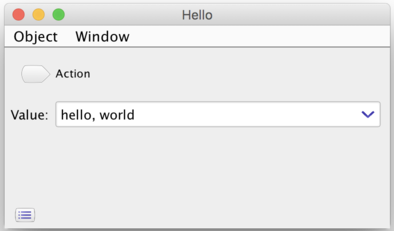

これは本ライブラリが、まず`value`インスタンスフィールドからテキストフィールドを作り出していることを意味します。
このフィールドの型である`String`によってコンポーネントの種類はテキストフィールドになります。
ユーザーが生成されたウィンドウ上でテキストフィールドの文字列を編集した場合、本ライブラリは自動的に与えられたオブジェクト`h`のフィールドの値を入力された文字列に代入します。これは`jsehll> h.value`を実行することで確認することができるでしょう。

また、メソッド`action`はツールバーのボタンのアクションに紐づきます。
ボタンをクリックすると与えられたオブジェクトに対してそのメソッドが実行されます。

## サンプルアプリケーション


[`src/test/java/autogui/demo`](https://github.com/ppp-kohe/autogui/tree/master/src/test/java/org/autogui/demo)以下にサンプルアプリケーションのソースコードがあります。

コマンド`mvn test-compile exec:java  -Dexec.classpathScope=test -Dexec.mainClass=...`によって上記のディレクトリにあるコードを実行することができます。

### ImageFlipDemo

下記のコードは以下のコマンドで実行できます: 

```bash
 mvn test-compile exec:java -Dexec.classpathScope=test \
    -Dexec.mainClass=org.autogui.demo.ImageFlipDemo
```

この `ImageFlipDemo.java`は多少意味のある実用的なサンプルです。

```java
package org.autogui.demo;

import org.autogui.swing.AutoGuiShell;
import javax.imageio.ImageIO;
import java.awt.image.BufferedImage;
import java.io.File;

public class ImageFlipDemo {
    public static void main(String[] args) {
        AutoGuiShell.showLive(new ImageFlipDemo());
    }
    BufferedImage image;
    File output = new File("output.png");
    
    void flipY() {
        int w = image.getWidth();
        int h = image.getHeight();
        BufferedImage newImage = new BufferedImage(w, h, image.getType());
        for (int y = 0; y < h; ++y) {
            for (int x = 0; x < w; ++x) {
                newImage.setRGB(x, h - y - 1, image.getRGB(x, y));
            }
        }
        image = newImage;
    }
    
    void save() throws Exception {
        if (output.exists()) {
            System.err.println("File already exists: " + output);
            return;
        } else {
            ImageIO.write(image, "png", output);
        }
    }
}
```

このプログラムは下図のようなGUIウィンドウを表示します:

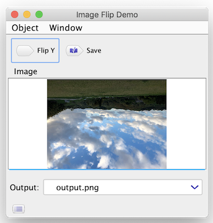

この表示されたウィンドウは以下のGUIコンポーネントを持ちます:

* 画像を表示する*Image*ペイン: フィールド`BufferedImage image`から生成されます。画像ファイルをドラッグ&ドロップで入力データとして設定することができます。ドロップした画像は自動的に [`BufferedImage`](https://docs.oracle.com/en/java/javase/11/docs/api/java.desktop/java/awt/image/BufferedImage.html) オブジェクトとして読み込まれペインに表示された後、フィールドに代入されます。
* アクションボタン*Flip Y*: メソッド`void flipY()`から生成されます。画像をドロップして入力した後、ボタンをクリックすると画像がY方向で反転します。メソッドの実行で、生成された画像オブジェクト`newImage`が`image`フィールドに代入されます。メソッドの実行後、画像ペインは反転した画像を即座に表示するでしょう。
* ファイル名テキストフィールド*Output*: フィールド`File output`から生成されます。このテキストフィールドは最初はフィールドの初期値"output.png"を表示します。テキストフィールドを編集するとフィールドの値が変更され、新しい[`File`](https://docs.oracle.com/en/java/javase/11/docs/api/java.base/java/io/File.html) を保持するようになります。
* アクションボタン*Save*: メソッド`void save()`から生成されます。このアクションは反転した画像を新たなファイルとしてOutputフィールドに設定されたファイルへ書き出します。

### FileRenameDemo

この例はライブラリのテーブル生成機能のデモアプリケーションです。

```bash
mvn test-compile exec:java -Dexec.classpathScope=test \
    -Dexec.mainClass=org.autogui.demo.FileRenameDemo
```

上記のコマンドは下図のようなGUIウィンドウを表示します:


利用方法としては、*Dir*フィールドにディレクトリをドラッグ&ドロップで設定すると、*Entries*テーブルにディレクトリの内容の一覧を表示します。

ソースコードは下記のようになっています: 

```java
package org.autogui.demo;

import org.autogui.GuiIncluded;
import org.autogui.swing.AutoGuiShell;

import java.io.File;
import java.util.*;

@GuiIncluded public class FileRenameDemo {
    public static void main(String[] args) {
        AutoGuiShell.get().showWindow(new FileRenameDemo());
    }

    File dir;

    @GuiIncluded public File getDir() { return dir; }
    @GuiIncluded public void setDir(File dir) {
        boolean update = 
             dir != null && !Objects.equals(this.dir, dir);
        this.dir = dir;
        if (update && dir.isDirectory()) {
            List<RenameEntry> es = new ArrayList<>();
            int i = 0;
            List<File> files = new ArrayList<>(
                            Arrays.asList(dir.listFiles()));
            files.sort(Comparator.naturalOrder());
            for (File file : files) {
                es.add(new RenameEntry(file, 
                  String.format("%03d-%s", 
                                i, file.getName())));
                ++i;
            }
            entries = es;
        }
    }

    List<RenameEntry> entries = new ArrayList<>();

    @GuiIncluded public List<RenameEntry> getEntries() { 
        return entries; 
    }

    @GuiIncluded public static class RenameEntry {
        File file;
        String newName;
        public RenameEntry(File file, String newName) {
            this.file = file;
            this.newName = newName;
        }
        @GuiIncluded public File getFile() {
            return file;
        }
        @GuiIncluded public String getNewName() {
            return newName; 
        }
        @GuiIncluded public void setNewName(String newName) {
            this.newName = newName;
        }
    }

    @GuiIncluded public void rename() {
        for (RenameEntry e : entries) {
            File newFile = new File(
                e.getFile().getParentFile(), e.getNewName());
            if (e.getFile().exists() && !newFile.exists()) {
                e.getFile().renameTo(newFile);
            }
        }
    }
}
```

* このデモにおいて、本ライブラリは`@GuiIncluded`アノテーションがついたメンバからのみGUIコンポーネントを生成します。この利用形態を*Strictモード*と呼んでおり、`AutoGuiShell.get().showWindow(...)`によって起動します。
* ファイルパスフィールド*Dir*: 文字列を編集すると`File`オブジェクトを生成して`setDir(File)`メソッドの引数に与えて呼び出します。このメソッドは引数のディレクトリからファイル一覧を取得し、`RenameEntry`オブジェクトとして`ArrayList`に生成して追加します。
`RenameEntry`はstaticなネストクラスで、`File`オブジェクトとインデックス番号を持つ新しいファイル名のプレフィックス文字列を保持します(`String.format("%03d-%s",...)`によって設定)。
* *Entries*テーブル: `getEntries()`メソッドで返される`List`から生成されます。さらにこのテーブルのカラムは`List`の要素型である`<RenameEntry>`の*File*と*New Name*プロパティから生成されます。
テーブルの各行は`List`オブジェクトの各要素と対応します。
ゲッターメソッドが返す`List`オブジェクトのアイデンティティが変化するとテーブルが変更されたとみなし、自動的にテーブルの行データの表示が更新されます。
* *Rename*ボタン: `rename()`メソッドから生成され、エントリのファイル名を更新します。

本ライブラリのコレクションオブジェクトからのテーブルコンポーネント生成機能は特に強力で、アプリケーションの適用範囲がとても広くなります。

## @GuiIncludeを使ったStrictモード

本ライブラリを`main`メソッドから実行するアプリケーションで利用する場合、GUIコンポーネントに対応するメンバーを限定する方が望ましいと言えます。
[`@GuiIncluded`](https://www.autogui.org/docs/apidocs/latest/org.autogui/org/autogui/GuiIncluded.html) と
[`AutGuiShell.get().showWindow(o)`](https://www.autogui.org/docs/apidocs/latest/org.autogui/org/autogui/swing/AutoGuiShell.html) によってこの制限を得ることができます。

Strictモードは...

* [`AutoGuiShell.get().showWindow(o)`](https://www.autogui.org/docs/apidocs/latest/org.autogui/org/autogui/swing/AutoGuiShell.html#showWindow(java.lang.Object)) によって起動します。
* [`@GuiIncluded`](https://www.autogui.org/docs/apidocs/latest/org.autogui/org/autogui/GuiIncluded.html)が付加された`public`なクラス、プロパティ、メンバーのみを対象とします。

以下のJavaプログラムはStrictモードのサンプルアプリケーションです:

```java
  import org.autogui.GuiIncluded;
  import org.autogui.swing.AutoGuiShell;
   
  @GuiIncluded
  public class Hello {
      public static void main(String[] args) {
          AutoGuiShell.get().showWindow(new Hello());
      }
       
      @GuiIncluded
      public String hello;
      
      @GuiIncluded
      public void action() {
          System.out.println(hello);
      }
       
      @GuiIncluded
      public NonIncludedType label = new NonIncludedType(); 
         //このプロパティはtoString()を表示するラベルになる
       
      static class NonIncludedType {
          public String toString() { return "non-included"; }
      }
  }
```


`AutoGuiShell`クラスのインスタンスメソッド[`showWindow`](https://www.autogui.org/docs/apidocs/latest/org.autogui/org/autogui/swing/AutoGuiShell.html#showWindow(java.lang.Object))は生成対象のメンバーを[`org.autogui.GuiIncluded`](https://www.autogui.org/docs/apidocs/latest/org.autogui/org/autogui/GuiIncluded.html) アノーテーションが付加されたもののみに限定します。 `AutoGuiShell.get().showWindow(o)`から利用する場合、GUIに含めたいすべてのメンバー(クラス、フィールド、ゲッターメソッド、セッターメソッド、アクションメソッド)にアノーテーションをつける必要があります。


## モジュールでの利用

Java 9以降に導入されたモジュールシステム上で本ライブラリを利用する場合、モジュールメンバーとして定義されたコードを本ライブラリに「公開(open)」する必要があります。これはライブラリがリフレクションAPIを通じて対象オブジェクトのコードにアクセスするためです。
名前付きモジュールにおいて、リフレクションAPIは*open*されたメンバーのみに限定して利用できます。

本ライブラリのモジュール名は`org.autogui`です。以下の記述を`module-info.java`に追加する必要があります:

1. `open`修飾子を利用したいモジュール宣言に追加する。もしくは、`exports`(または`opens`) 利用したいパッケージ `to org.autogui;`　を追加する。
2. `requires org.autogui;`


```java
//自分の module-info.java の例
open module your.module { //"open"を自分のモジュールyour.moduleに追加する, もしくは...
    exports your.pack to org.autogui; //自分のパッケージyour.packを本ライブラリに公開する
                                  //もしくは "opens your.pack to autogui;" でも可能
    
    requires org.autogui;   //自分のコードから本ライブラリにアクセスできるようにする
    //なお、org.autogui はJDKの java.desktop, java.datatransfer, java.prefs モジュールに依存する
}
```

本ライブラリの初期のバージョン(-1.1)では*自動モジュール*でした。これは`module-info.class`を含まないjarで、Java 8以前との互換性を持っています。
この場合、本ライブラリのjarをクラスパスやモジュールパスの両方に追加することができます。しかし、自動モジュールはjlinkのモジュールに含めることができないという制限があります。

最近のバージョン(1.2-)では本ライブラリは`module-info.class`を含んでおり、Java 11以降の要求に対応しています。
この状態でもクラスパスとモジュールパスの両方に追加することができ、さらにjlinkによりカスタムイメージが生成できます。(一方で本ライブラリはリフレクションAPIに依存しているため、実際の製品に適用する場合は十分な考慮が必要です。)

## 対応する型とコンポーネント


* 基本的な値の型
  * [String text-field](#string-text-field): (文字列テキストフィールド) 
    [`java.lang.String`](https://docs.oracle.com/en/java/javase/11/docs/api/java.base/java/lang/String.html) 
  * [File text-field](#file-text-field): (ファイルパステキストフィールド)
    [`java.nio.file.Path`](https://docs.oracle.com/en/java/javase/11/docs/api/java.base/java/nio/file/Path.html)  または
    [`java.io.File`](https://docs.oracle.com/en/java/javase/11/docs/api/java.base/java/io/File.html)
  * [Number spinner](#number-spinner): (数値スピナー) 基本型の数値(`byte`, `short`, `int`, `long`, `float`, `double`) または
    [`java.lang.Number`](https://docs.oracle.com/en/java/javase/11/docs/api/java.base/java/lang/Number.html)のサブタイプ
  * [Boolean check-box](#boolean-check-box): (ブーリアンチェックボックス) `boolean` もしくは
    [`java.lang.Boolean`](https://docs.oracle.com/en/java/javase/11/docs/api/java.base/java/lang/Boolean.html)
  * [Enum pull-down menu](#enum-pull-down-menu): (列挙プルダウン) 
    [`java.lang.Enum`](https://docs.oracle.com/en/java/javase/11/docs/api/java.base/java/lang/Enum.html)のサブタイプ
  * [Image pane](#image-pane): (画像ペイン)
    [`java.awt.Image`](https://docs.oracle.com/en/java/javase/11/docs/api/java.desktop/java/awt/Image.html)のサブタイプ
  * [Document editor](#document-editor): (ドキュメントエディター)
    [`java.lang.StringBuilder`](https://docs.oracle.com/en/java/javase/11/docs/api/java.base/java/lang/StringBuilder.html) もしくは
    [`javax.swing.text.Document`](https://docs.oracle.com/en/java/javase/11/docs/api/java.desktop/javax/swing/text/Document.html)
  * [Embedded component](#embedded-component): (埋め込みコンポーネント) 
    [`javax.swing.JComponent`](https://docs.oracle.com/en/java/javase/11/docs/api/java.desktop/javax/swing/JComponent.html)のサブタイプ
* [Object pane](#object-pane): (オブジェクトペイン) ユーザー定義のオブジェクト型で、複数のプロパティとアクションの組み合わせ
  * オブジェクトのプロパティ: `T getP() {...}`, `T p() {...}` (1.2-) , `void setP(T) {...}` , `T p;`
      * もしすべてのメンバーが他のユーザー定義オブジェクトに関するものであれば、それらのオブジェクトはタブペインのタブに格納されます。
  * アクションメソッド: `void m() {...}`
* [Collection table](#collection-table): (コレクションテーブル) 
  [`java.util.Collection<E>`](https://docs.oracle.com/en/java/javase/11/docs/api/java.base/java/util/Collection.html)のサブタイプ、
   配列`E[]` 。カラムは要素型 `E`から生成されます。
  * カラム`E`の値型
      * 文字列カラム: 
        [`java.lang.String`](https://docs.oracle.com/en/java/javase/11/docs/api/java.base/java/lang/String.html)
      * ファイルカラム: 
        [`java.nio.file.Path`](https://docs.oracle.com/en/java/javase/11/docs/api/java.base/java/nio/file/Path.html) または
        [`java.io.File`](https://docs.oracle.com/en/java/javase/11/docs/api/java.base/java/io/File.html)
      * 数値カラム: 基本型の数値、もしくは
        [`java.lang.Number`](https://docs.oracle.com/en/java/javase/11/docs/api/java.base/java/lang/Number.html)のサブタイプ
      * ブーリアンカラム: `boolean` もしくは
        [`java.lang.Boolean`](https://docs.oracle.com/en/java/javase/11/docs/api/java.base/java/lang/Boolean.html)
      * 列挙カラム: 
        [`java.lang.Enum`](https://docs.oracle.com/en/java/javase/11/docs/api/java.base/java/lang/Enum.html)のサブタイプ
      * 画像カラム: 
        [`java.awt.Image`](https://docs.oracle.com/en/java/javase/11/docs/api/java.desktop/java/awt/Image.html)のサブタイプ
      * 埋め込みコンポーネントカラム:  [`javax.swing.JComponent`](https://docs.oracle.com/en/java/javase/11/docs/api/java.desktop/javax/swing/JComponent.html)のサブタイプ
  * [Object rows](#object-rows): (オブジェクト行)　ユーザー定義型のオブジェクトは、プロパティのメンバーによるカラムを組み合わせて生成する。 
  * 動的なコレクションテーブル: ネストした`Collection<Collection<E>>` か多次元配列 `E[][]`

### String text-field

[`java.lang.String`](https://docs.oracle.com/en/java/javase/11/docs/api/java.base/java/lang/String.html) のプロパティはテキストフィールドに紐づきます。

```java
  class Hello {
      String prop;
  }
  org.autogui.swing.AutoGuiShell.showLive(new Hello())
```


### File text-field

[`java.nio.file.Path`](https://docs.oracle.com/en/java/javase/11/docs/api/java.base/java/nio/file/Path.html) もしくは
[`java.io.File`](https://docs.oracle.com/en/java/javase/11/docs/api/java.base/java/io/File.html) のプロパティはファイルパス操作が可能なテキストフィールドに紐づきます。

```java
  import java.io.File;
  class Hello {
      File prop;  
  }
  org.autogui.swing.AutoGuiShell.showLive(new Hello())
```

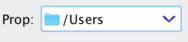


### Number spinner

数値をあらわす基本型 (`byte`, `short`, `int`, `long`, `float` and `double`) や
[`java.lang.Number`](https://docs.oracle.com/en/java/javase/11/docs/api/java.base/java/lang/Number.html) のサブタイプ、具体的には
[`java.math.BigInteger`](https://docs.oracle.com/en/java/javase/11/docs/api/java.base/java/math/BigInteger.html) や  [`java.math.BigDecimal`](https://docs.oracle.com/en/java/javase/11/docs/api/java.base/java/math/BigDecimal.html) は数値のスピナーに紐づきます。


```java
  class Hello {
      int prop;
  }
  org.autogui.swing.AutoGuiShell.showLive(new Hello())
```


### Boolean check-box

真偽値の`boolean` または
[`java.lang.Boolean`](https://docs.oracle.com/en/java/javase/11/docs/api/java.base/java/lang/Boolean.html) 
はチェックボックスに紐づきます。

```java
  class Hello {
      boolean prop;
  } 
  org.autogui.swing.AutoGuiShell.showLive(new Hello())
```


### Enum pull-down menu

`enum`型 (
[`java.lang.Enum`](https://docs.oracle.com/en/java/javase/11/docs/api/java.base/java/lang/Enum.html) 
のサブタイプ) はプルダウンメニューに対応づきます。 (編集テキストフィールドがないコンボボックス).
列挙型のメンバーがメニューアイテムになります。

```java
  enum HelloEnum {
      Hello, World
  }
  class Hello {
      HelloEnum prop = HelloEnum.Hello;
  }
  org.autogui.swing.AutoGuiShell.showLive(new Hello())
```


### Image pane


[`java.awt.Image`](https://docs.oracle.com/en/java/javase/11/docs/api/java.desktop/java/awt/Image.html) もしくはそのサブタイプは画像のプレビューが可能なペインに紐づきます。

```java
  import java.awt.*;
  class Hello {
      Image prop;
  }
  org.autogui.swing.AutoGuiShell.showLive(new Hello())
```


このペインはドラッグ&ドロップをサポートし、Altを押しながらマウスホイールスクロールにより拡大縮小が可能です。
コード上の画像の操作は[`java.awt.image.BufferedImage`](https://docs.oracle.com/en/java/javase/11/docs/api/java.desktop/java/awt/image/BufferedImage.html) と
[`javax.imageio.ImageIO`](https://docs.oracle.com/en/java/javase/11/docs/api/java.desktop/javax/imageio/ImageIO.html)が便利です。

```java
  import java.io.File;
  import java.awt.image.*;
  import javax.imageio.*;
  class Hello {
      private File file;
      void setFile(File f) throws Exception {
          file = f;
          if (f != null && f.isFile()) prop = ImageIO.read(f);
      }
      File getFile() { return file; }
      BufferedImage prop;
      int getImageWidth() {
          return prop == null ? 0 : prop.getWidth();
      }
      int getImageHeight() {
          return prop == null ? 0 : prop.getHeight();
      }
  }
  org.autogui.swing.AutoGuiShell.showLive(new Hello())
```

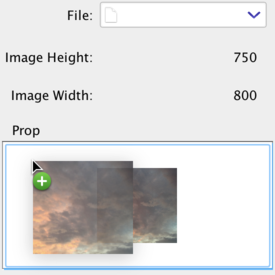


### Document editor

[`java.lang.StringBuilder`](https://docs.oracle.com/en/java/javase/11/docs/api/java.base/java/lang/StringBuilder.html)
もしくは
[`javax.swing.text.Document`](https://docs.oracle.com/en/java/javase/11/docs/api/java.desktop/javax/swing/text/Document.html) のサブタイプはテキストエディタに紐づきます。

```java
  class Hello {
      StringBuilder prop = new StringBuilder();
  }
  org.autogui.swing.AutoGuiShell.showLive(new Hello())
```

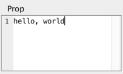

プロパティ値の変更(ドキュメントオブジェクトのアイデンティティの変更)はエディタのドキュメントを置き換えることになります。
したがって、このプロパティはユーザーの編集のために一貫した参照値を返す必要があります。


#### ドキュメントプロパティの適切な利用方法

テキストエディターのペインはプロパティの値に紐づいたテキスト内容の編集を反映します。

`StringBuilder`については、そのオブジェクトをラップする`Document`オブジェクトが自動で生成されます。
そのドキュメントの編集に関する現在の実装は簡単なものになっており、巨大なサイズのテキストを編集する用途には適していません。

Swingのドキュメントとテキスト編集コンポーネント群は、どうやらどんなドキュメントの変更もテキスト編集コンポーネント内で起こることを仮定しているように見えます。
したがって、**ユーザー定義のコードで`StringBuilder`や`Document`のプロパティ値の内容を変種することは避けるべきです。**

プロパティが[`javax.swing.text.StyledDocument`](https://docs.oracle.com/en/java/javase/11/docs/api/java.desktop/javax/swing/text/StyledDocument.html)型のサブタイプの場合、もしくは`StringBuilder`の場合は、エディタ上で(ドキュメント全体の)スタイルをコンテキストメニューから変更することができます。


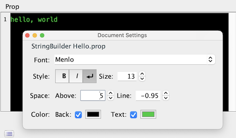

### Object pane

ユーザー定義のオブジェクトのクラスのプロパティはそのクラスのメンバーを組み合わせたペインに紐づきます。

```java
  class Hello {
      String prop1;
      int prop2;
      E prop3 = new E();
      void action() {
          System.out.printf("Hello: %s %d %s\n", prop1, prop2, prop3);
      }
  }
  class E {
      String prop;
      void actionE() {
          System.out.printf("E: %s\n", prop);
      }
  }
  org.autogui.swing.AutoGuiShell.showLive(new Hello())
```

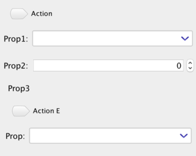

あるブジェクトのクラスは他のオブジェクトクラスのプロパティを持つことができ、それらは各オブジェクトに対応したサブペインとなります。

オブジェクトクラスのメンバーはアクションメソッドを含むことができ、それらはツールバーのボタンとなります。
これらのメソッドの条件としてその名前は`get`, `is`, `set`で開始せず、引数を1つも取らない必要があります。

そのようなアクションメソッドは(当然)オブジェクトのプロパティを読み書きすることができます。もし、アクションメソッドがオブジェクトのプロパティを変更した場合、メソッド実行後、本ライブラリのUIは自動的に変更されたプロパティを特定し、プロパティに紐づいたUIコンポーネントを更新します。


#### プロパティ定義

ユーザー定義のオブジェクトクラスはサブコンポーネントに紐づいたプロパティを持つことができます。
ここで、*プロパティ*とは 1) アクセス可能なフィールド もしくは 2) ゲッターとセッターメソッドのペア として定義されます。


```java
  class Hello {
      String prop1; 
      
      private String prop2 = "hello";
      String getProp2() { return prop2; } //read-only
      
      private String prop3;
      String getProp3() { return prop3; }
      void setProp3(String p) {
          prop3 = p;
          System.err.println("updated " + prop3);
      }
      
      private boolean flag = true;
      boolean isFlag() { return flag; } //is...() for boolean
      void setFlag(boolean b) { flag = b; } 
  }
  org.autogui.swing.AutoGuiShell.showLive(new Hello())
```


*ゲッター*メソッドは名前が`get`または`is`(真偽値の場合)で開始し、引数を取らず、プロパティの型で値を返す定義です。

本ライブラリの1.2以降では `T prop()` メソッド(例えば`String prop()`)が*ゲッター*として利用できるようになりました。
これはJava 14で導入された[*レコード型*](https://openjdk.java.net/jeps/359)をサポートするためです。
この規則は既存のアクションメソッドを意図せずプロパティにしてまう可能性があります(voidでない型を返す場合)。
アクションメソッドとして認識させたい場合アノーテーションのパラメータ[`@GuiIncluded(action=true)`](https://www.autogui.org/docs/apidocs/latest/org.autogui/org/autogui/GuiIncluded.html#action())を指定することで実現できます。

*セッター*メソッドは名前が`set`で開始し、プロパティの値の型を1つとる定義です。

もしプロパティがゲッターメソッドのみで定義された場合、プロパティの値は*読み出し専用*になります。

セッターメソッド内のコードでは他のプロパティの値の変更を行うことができます。生成されたUIは自動的に変更されたプロパティを特定します。
このUIの更新を実現するため、ゲッターメソッドは頻繁に呼び出されます。


#### AutoCloseableサポート

ユーザー定義のオブジェクトクラスが[`java.lang.AutoCloseable`](https://docs.oracle.com/en/java/javase/11/docs/api/java.base/java/lang/AutoCloseable.html)インターフェースを実装する場合、そのオブジェクトの[`close()`](https://docs.oracle.com/en/java/javase/11/docs/api/java.base/java/lang/AutoCloseable.html#close())メソッドが対応するウィンドウを閉じた時に自動的に実行されます。

(なお`AutoGuiShell.showLive(o)` で生成されたウィンドウはウィンドウを閉じても自動的に呼び出しません。ウィンドウを完全に閉じるには[`cleanUp()`](https://www.autogui.org/docs/apidocs/latest/org.autogui/org/autogui/swing/GuiSwingWindow.html#cleanUp())を利用してください。)


#### アクションプロパティの組み合わせ

特別な追加規則として、オブジェクトペインでのアクションボタンとテキストフィールドを組み合わせることができます:

* オブジェクトペインのクラスが`String <propName>`プロパティを持っており、
* そのクラスが`<propName>Action()`という名前のアクションメソッドを持つ場合

この時、文字列のプロパティに紐づいたテキストフィールはそのメソッドに対応するボタンを内包します。


```java
import java.util.regex.*;
class PatternFind {
    String text;
    String search;
    void searchAction() {
        var m = Pattern.compile(search).matcher(text);
        if (m.find()) {
            System.out.printf("found: %d%n", m.start());
        } else {
            System.out.println("not found");
        }
    }
}
org.autogui.swing.AutoGuiShell.showLive(new PatternFind())
```


### Object tabbed-pane

ユーザー定義のオブジェクトがプロパティとして他のユーザー定義オブジェクト型のメンバーしか持たない場合、そのオブジェクトはタブペインに紐づきます。そしてメンバーのユーザー定義オブジェクトから生成されたペインが各タブに対応します。

```java
  class Hello {
      Tab1 tab1 = new Tab1();
      Tab2 tab2 = new Tab2();
  }
  class Tab1 {
      String prop;
  }
  class Tab2 {
      int prop;
  }
  org.autogui.swing.AutoGuiShell.showLive(new Hello())
```

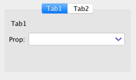


### Embedded component


[`javax.swing.JComponent`](https://docs.oracle.com/en/java/javase/11/docs/api/java.desktop/javax/swing/JComponent.html)のサブタイプはサブコンポーネントとして埋め込みのペインに紐づきます。


```java
  import java.awt.*;
  import javax.swing.*;
  class Hello {
      private JComponent value;
      JComponent getValue() {
          if (value == null) { 
              value = new JPanel() {
                  { setPreferredSize(new Dimension(300, 300)); }
                  protected void paintComponent(Graphics g) {
                      g.setColor(Color.white);
                      g.fillRect(0, 0, getWidth(), getHeight());
                      g.setColor(Color.blue);
                      g.drawString("hello, world", 30, 30);
                  }
              };
          }
          return value;
      }
  }
  org.autogui.swing.AutoGuiShell.showLive(new Hello());
```

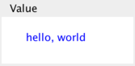

ユーザー定義のUIコンポーネントを作る場合、Swingコンポーネントの規則に従う必要があります。すなわち、コンポーネントのコードは基本的にはイベント駆動スレッド上で実行される必要があります。
そして、フィールドの初期化はイベント駆動スレッドでないスレッド(例えばメインスレッド)で実行される可能性があり注意が必要です。

よって埋め込みコンポーネントのプロパティに対するユーザーコードは*ゲッターメソッドで定義し、返すコンポーネントをフィールドにキャッシュする*というスタイルをとるべきです。
埋め込みコンポーネントのプロパティには本ライブラリはイベントディスパッチ内で実行します。プロパティから得られた埋め込みコンポーネントはオブジェクトペインのサブコンポーネントとして追加されます。

#### Swingアプリケーションでの埋め込み

本ライブラリによってオブジェクトから生成したGUIを別のSwingアプリケーションに埋め込みたい場合、[`org.autogui.swing.GuiSwingRootPane.createForObject(o)`](https://www.autogui.org/docs/apidocs/latest/org.autogui/org/autogui/swing/GuiSwingRootPane.html#createForObject(java.lang.Object)).
が利用できます。

[`src/test/java/org/autogui/demo/ObjectEmbeddedDemo.java`](https://github.com/ppp-kohe/autogui/tree/master/src/test/java/org/autogui/demo/ObjectEmbeddedDemo.java)を参照してください。

サンプル実行:

```bash
 mvn test-compile exec:java -Dexec.classpathScope=test \
    -Dexec.mainClass=org.autogui.demo.ObjectEmbeddedDemo
```

### Collection table

[`java.util.Collection<E>`](https://docs.oracle.com/en/java/javase/11/docs/api/java.base/java/util/Collection.html)のサブタイプもしくは配列型`E[]`のプロパティはテーブルペインに紐づきます。
テーブルのカラムは型引数`E`から生成されます。


```java
  import java.util.*;
  class Hello {
      List<String> prop = new ArrayList<>();
      
      void add() {
          prop.add("hello " + prop.size());
          prop = new ArrayList<>(prop); 
      }
  }
  org.autogui.swing.AutoGuiShell.showLive(new Hello())
```

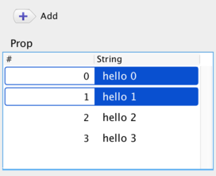

*何らかのアクションメソッドからテーブルの表示を更新したい場合、リストのインスタンスを置き換える必要があります。* `prop = new ArrayList<>(prop);`が最も簡単な方法です。

#### Object rows

`Collection<E>`の型引数`E`がユーザー定義のオブジェクトクラスの場合、テーブルのカラムはそのクラスのプロパティから生成されます。


```java
   import java.util.*;
   class Hello {
       List<Item> prop = new ArrayList<>();
       void add() {
           prop.add(new Item("hello " + prop.size(), (int) (Math.random() * 100)));
           prop = new ArrayList<>(prop);
       }
   }
   class Item {
       String name;
       int num;
       Item(String n, int i) { this.name = n; this.num = i; }
   }
   org.autogui.swing.AutoGuiShell.showLive(new Hello())
```

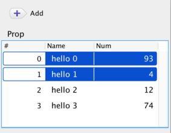

#### コレクションテーブルの選択行に対するアクション

もし、型引数`E`のコレクションプロパティを定義するオブジェクトクラスがさらに別の[`java.util.List<E>`](https://docs.oracle.com/en/java/javase/11/docs/api/java.base/java/util/List.html)型の引数をとるメソッドを持つ場合、対応するテーブルはそのメソッドに紐づいたアクションボタンを持つツールバーを持つことになります。
このボタンはテーブル上で選択された行に対応する要素をリストとして引数に与えて
メソッドを実行します。

もし、コレクションの要素オブジェクトがアクションメソッドを持つ場合、その場合もテーブルがツールバーにメソッドに紐づいたボタンを持ちます。
このボタンはテーブル上で選択された行に対応するオブジェクトにそれぞれ対してメソッドを実行します。


```java
   import java.util.*;
   class Hello {
       List<Item> prop = new ArrayList<>();
       void add() {
           prop.add(new Item("hello " + prop.size(), (int) (Math.random() * 100)));
           prop = new ArrayList<>(prop);
       }
       void remove(List<Item> selectedItems) {
           prop.removeAll(selectedItems);
           prop = new ArrayList<>(prop);
       }
   }
   class Item {
       String name;
       int num;
       Item(String n, int i) { this.name = n; this.num = i; }
       void update() { ++num; }
   }
   org.autogui.swing.AutoGuiShell.showLive(new Hello())
```

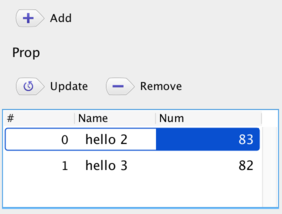

#### テーブル要素の選択の管理

リストに対して生成されたテーブルは要素セルの選択を操作する機能として
現在、以下の2種類があります:

* 選択要素を変更するためのアクションになる特別なメソッドを定義する:　メソッドは変更後の要素のリストを返すようにします。[`@GuiListSelectionUpdater`](https://www.autogui.org/docs/apidocs/latest/org.autogui/org/autogui/GuiListSelectionUpdater.html)アノーテーションにより特定されます。
* テーブルUIから選択された要素を受け取るコールバックとなる特別なメソッドを定義する: [`@GuiListSelectionCallback`](https://www.autogui.org/docs/apidocs/latest/org.autogui/org/autogui/GuiListSelectionCallback.html)アノーテーションによって特定されます。

```java
import java.util.*;
import org.autogui.*;
class Hello {
    List<Item> prop = new ArrayList<>();
    void add() {
        prop.add(new Item("Hello " + prop.size()));
        prop = new ArrayList<>(prop);
    }
    @GuiListSelectionUpdater
    List<Item> selectTop() {
        return Arrays.asList(prop.get(0));
    }
    @GuiListSelectionCallback
    void selected(List<Item> items) {
        System.out.println("selected: " + items);
    }
}
class Item {
    String name;
    Item(String n) { this.name = n; }
    public String toString() { return "Item(" + this.name + ")"; }
}
org.autogui.swing.AutoGuiShell.showLive(new Hello())
```

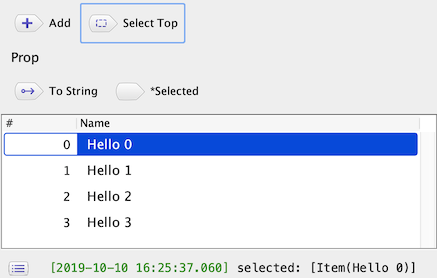

上記の例で`List<Item> selectTop()`は`@GuiListSelectionUpdater`を付加しています。このメソッドはアクションボタン"Select Top"を生成し、実行すると`prop`テーブルの選択要素をリストの先頭の要素に(その要素のリストを返すことで)変更します。

また、`void selected(List<Item> items)` は`@GuiListSelectionCallback` を付加しており、引数に要素のリストを受け取ります。このメソッドもアクションボタンになりますが、"*Selected"と先頭にマークが付き、`prop`テーブルの選択の変更により自動で実行されます。

これらの特別なメソッドの対象となるテーブルは、要素の型、すなわち `List<E>`の型引数`E`によって特定されます。もし2つ以上のテーブルが同一の要素型をこれらのメソッドで使っていたら、それらすべてのテーブルがメソッドにより操作されます。

追加の特別な機能として、これらのアノーテーションがたは真偽型の引数`index`を受け取ることができます。このフラグのデフォルト値はfalseで、trueが指定されると、付加された特別なメソッドは`List<Integer>`を取ることを前提するようになります。この整数値は要素型`E`の代わりに行番号を扱うようになります。さらに`List<int[]>`だった場合は{行番号,カラム番号}を意味します。

#### セルのサイズ変更

生成されたテーブルにはカラムと行の表示サイズを変更する機能があり、テーブルヘッダーのポップアップメニュー(右クリックで開くコンテキストメニュー)から利用できます。


* *Set All Column Width to This* : すべてのカラムのサイズを対象カラムと同じにします
* *Auto Resize Column Width* : 自動的にすべてのカラムサイズを設定します
* *Row Height* : 行の高さを設定を変更します
    * *Fixed Size* : すべての行を特定の高さに設定します。
    * *Fit to Content* : すべての行の高さをその行の内容から決定します。

### 名前の規則と@GuiIncluded(name=...)

プロパティやアクション、型の名前の表示は[camelCase](https://en.wikipedia.org/wiki/Camel_case)の規則により決定します。

```java
  class Hello {
      String helloWorld; //=> "Hello World"
      String helloWORLD; //=> "Hello WORLD"
  }
```

[`@GuiIncluded(name=...)`](https://www.autogui.org/docs/apidocs/latest/org.autogui/org/autogui/GuiIncluded.html#name())アノーテーションにより任意の名前を設定することもできます。

```java
  class Hello {
      @GuiIncluded(name="class") String klass;
  }
```


### @GuiIncluded(index=...)による表示順の調整

コンポーネントの表示順は[`@GuiIncluded(index=...)`](https://www.autogui.org/docs/apidocs/latest/org.autogui/org/autogui/GuiIncluded.html#index())アノーテーションにより調整できます。
指定がない場合、デフォルトではプロパティの名前から決定します。

```java
  import org.autogui.GuiIncluded;
  class Hello {
      @GuiIncluded(index=3) String prop1;
      @GuiIncluded(index=2) String prop2;
      
      private String prop3;
      @GuiIncluded(index=1) String getProp3() { return prop3; } 
      void setProp3(String p) { prop3 = p; }
  }
  org.autogui.swing.AutoGuiShell.showLive(new Hello())
```


ゲッターやセッターのペアに付加されたアノーテーションの場合、片方につけられたものが適用されます。

### @GuiIncluded(description=...)によるコンポーネントの説明文

[`@GuiIncluded(description=...)`](https://www.autogui.org/docs/apidocs/latest/org.autogui/org/autogui/GuiIncluded.html#description())アノーテーションによりメンバーのツールチップメッセージを設定することができます。

```java
   import org.autogui.GuiIncluded;
   class Hello {
       @GuiIncluded(description="component description") String prop;
   }
```

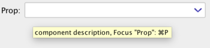

### @GuiIncluded(keyStroke=...)によるキー割り当て

本ライブラリは自動的にメンバー名からショートカットキーを設定します。[`@GuiIncluded(keyStroke=...)`](https://www.autogui.org/docs/apidocs/latest/org.autogui/org/autogui/GuiIncluded.html#keyStroke())アノーテーションによって明示的に設定することもできます。

* `keyStroke="none"`: 割り当てを行わないようにします
* `keyStroke="<control>... <key>"`
  * `control ::= shift | alt`
  * `key ::= A | B | C |... | Z | 0 | 1 ... | 9  `
* 予約されたキー: これらのキーはコマンド(macOS)かコントロールキーとの組み合わせになります
  * `Q`: 終了, `W`: ウィンドウを閉じる
  * `shift R`: 表示更新
  * `A`: すべて選択, `shift A`: 選択解除
  * `Z`: 取り消す, `shift Z`: やり直す
  * `O`: 開く, `S`: 保存
  * `X`: カット, `C`: コピー, `V`: ペースト
  * `alt O`: JSONを開く, `alt S`: JSONを保存,`alt X`: JSONとしてカット,`alt C`: JSONとしてコピー, `alt V`: JSONをペースト
  * `,`: 設定

```java
   import org.autogui.GuiIncluded;
   class Hello {
       @GuiIncluded(keyStroke="L") String prop; 
       @GuiIncluded(keyStroke="T") void action() {
           System.out.println("action " + prop);
       }
       
       //automatically bound by the method name "action2", like Shift+Cmd+A
       void action2() { 
           System.out.println("action2");
       }
   }
   org.autogui.swing.AutoGuiShell.showLive(new Hello())
```


アクションに対するショートカットキーの実行は対象となるアクションの実行になります。
プロパティに対するショートカットキーの実行はUI上で対象コンポーネントにフォーカスします。
また、*コントロール + エンターキー*はフォーカス中のコンポーネントのコンテキストメニューを表示します。

## UI要素の能動的な更新

本ライブラリで生成されたGUIコンポーネントはデフォルトでは自動的に表示を更新します。これは、何かアクションが発生した後にプロパティにアクセスして、再表示が必要な変更があるかどうかを確認することで実現しています。

[`@GuiNotifierSetter`](https://www.autogui.org/docs/apidocs/latest/org.autogui/org/autogui/GuiNotifierSetter.html)アノーテーションの機能を使うことで、特定のGUI要素の能動的な更新が可能になります。
これは更新用の[`Runnable`](https://docs.oracle.com/en/java/javase/13/docs/api/java.base/java/lang/Runnable.html)オブジェクトがユーザーコードに与えられます。
このアノーテーションは`Runnable`を引数にとる特別なセッターメソッドに付加します。
ユーザーコードでは与えられた`Runnable`を保持して`run()`メソッドを呼ぶことで対象GUI要素が必要なときに再表示を行うことができます。
この対象GUI要素はメソッドのシグニチャ`set<YourPropertyName>Notifier(Runnable r)` かアノーテーション引数`@GuiNotifierSetter(target="yourPropertyName")`から決定します。

```java
import java.util.concurrent.*;
import org.autogui.*;
import java.time.*;

class Hello implements AutoCloseable {
   private ScheduledExecutorService service;
   private ScheduledFuture<?> task;
   
   String prop;
   
   private Runnable updater;
   @GuiNotifierSetter 
   void setPropUpdater(Runnable r) { updater = r; }
   
   Hello() {
      service = Executors.newScheduledThreadPool(1);
      task = service.scheduleWithFixedDelay(this::update, 0, 3, TimeUnit.SECONDS);
   }
   private void update() {
      prop = Instant.now().toString();
      if (updater != null) {
          updater.run();
      }
   }
   public void close() {
       task.cancel(true);
       service.shutdownNow();
   }
}
org.autogui.swing.AutoGuiShell.showLive(new Hello())
```

上記のサンプルはテキストフィールドを表示し、3秒ごとにそのテキスト表示を更新します。

更新は`update()`メソッドで行われます。そこでは`prop`を時刻の文字列 [`Instant.now().toString()`](https://docs.oracle.com/en/java/javase/13/docs/api/java.base/java/time/Instant.html#now())  で更新し、`Runnable#run()`を呼び出すことでフィールドの変更を通知します。このRunnableは`setPropUpdater(Runnable)`で設定された本ライブラリから与えられるオブジェクトをupdaterとして保持します。
このセッターは`set<YourPropertyName>Updater`の名前の規則に従い`prop`フィールドを更新対象として指定しています。

コンストラクタでは`update()`メソッドが定期的に実行されるようスケジュールされます。これは[`ScheduledExecutorService#scheduleWithFixedDelay(this::update, ...)` ](https://docs.oracle.com/en/java/javase/11/docs/api/java.base/java/util/concurrent/ScheduledExecutorService.html#scheduleWithFixedDelay(java.lang.Runnable,long,long,java.util.concurrent.TimeUnit))により`ScheduledFuture`タスクとして生成します。

## 初期設定の管理

生成されたウィンドウは内包するサブコンポーネントに紐づくプロパティ値を保存して再利用する機能を持ちます。
この機能は[`java.util.prefs`](https://docs.oracle.com/en/java/javase/11/docs/api/java.prefs/java/util/prefs/package-summary.html)を利用して実現します。


```java
   class Hello {
       String prop;
   }
   org.autogui.swing.AutoGuiShell.showLive(new Hello())
```

本ライブラリでは、割り当てられたコンポーネントを通じて編集されたプロパティの値が初期設定として自動的に保存されます。
生成されたウィンドウの*Object*メニューにある*Preferences...*から保存された初期設定を編集することができます。


このメニューは上記のような初期設定のウィンドウを表示します。画面には保存された初期設定がリストされます。

このリストには以下の初期設定が表示されます:

* *Current* : デフォルトの(名前のない)初期設定です。この初期設定の値はUI操作で更新されます。
* *Empty* : リセットのために値がないことを表現する擬似的な初期設定
* 保存された初期設定 : 保存された初期設定で、ツールバーの*Save*アクションから追加できます。このアクションを実行すると現在のUIコンポーネントから値と設定を収集して新たな初期設定として記録します。リスト上でダブルクリックにより名前を変更できます。

初期設定のリストには"Apply at Launch"というチェックボックスのカラムがあります。チェックが入った初期設定が起動時に適用されます。

初期設定ウィンドウのツールバーには*Delete*と*Duplicate*アクションがあり、これらは選択した初期設定を削除/複製することができます。
*Update*アクションは選択した初期設定を最新のUIコンポーネントの値により上書きします。
*Apply*アクションは即時に選択された初期設定をUIコンポーネントに適用します。
*Write To File...*と*Load From File...*アクションは初期設定をJSONファイルに保存/読み込みすることができます。

本ライブラリの1.7以降では選択された初期設定を画面の右側のペインで直接編集することができます。

また、保存した初期設定は*Object*メニューの*Apply Preferences*メニューの項目にリストされ、選択することで適用できます。

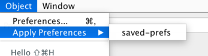


[`GuiPreferencesLoader`](https://www.autogui.org/docs/apidocs/latest/org.autogui/org/autogui/base/mapping/GuiPreferencesLoader.html) クラスを利用することでGUIを使わないコードで初期設定の機能を利用することができます。

```java
   var h = new Hello();
   org.autogui.base.mapping.GuiPreferencesLoader.get()
     .withTypeBuilderRelaxed()
     .withPrefsGetterByNameEquals("saved-prefs")
     .apply(h);

   h.prop //=> "Hello" 
```


### 埋め込みコンポーネントのカスタム初期設定

本機能を利用する場合、カスタムコンポーネントが[`GuiPreferences.PreferencesJsonSupport`](https://www.autogui.org/docs/apidocs/latest/org.autogui/org/autogui/base/mapping/GuiPreferencesLoader.PreferencesJsonSupport.html) インターフェースを実装する必要があります。
このインターフェースは2つのメソッドの実装を要求します。それぞれ初期設定の生成と設定をJSONオブジェクトとして扱います。


```java
import org.autogui.base.mapping.GuiPreferences;
import javax.swing.*;
import java.util.*;

class Hello { //オブジェクトペインの型
    MyPane pane;
    MyPane getPane() { //カスタムした型の埋め込みコンポーネントを返す
        if (pane == null) pane = new MyPane();
        return pane;
    }
}

class MyPane extends JPanel
     implements GuiPreferences.PreferencesJsonSupport {
    JTextField data = new JTextField(20);
    MyPane() { 
        add(data); 
    }
    public Map<String,Object> getPrefsJson() { //初期設定ストアに書き出すための値
        System.err.println("save " + data.getText());
        return Map.of("myItem", data.getText());
    }
    @SuppressWarnings("unchecked")
    public void setPrefsJson(Object v) { //初期設定ストアから復元されたデータを設定
        if (v instanceof Map<?,?>) {
            data.setText(((Map<String,String>) v).getOrDefault("myItem", ""));
        }
    }
}
org.autogui.swing.AutoGuiShell.showLive(new Hello())
```

`getPrefsJson()`で返されるオブジェクトは単純なJSONの型の組み合わせでなければなりません(Map、List、String、Number、Boolean)。
また、初期設定ストアに保存できるように十分に小さいデータサイズである必要があります。

## ロギング

生成されたウィンドウはステータスバーとログエントリを表示するリスト表示の機能を持っています。ロギングエントリは以下の種類があります:

* 文字列メッセージ
* 進捗バー
* 例外

### 文字列メッセージのログ

生成されたウィンドウは
[`System.err`](https://docs.oracle.com/en/java/javase/11/docs/api/java.base/java/lang/System.html#err) と 
[`System.out`](https://docs.oracle.com/en/java/javase/11/docs/api/java.base/java/lang/System.html#out)を置き換えます。置き換えられたこれらのストリームからの出力はステータスバーとリストウィンドウにも表示されます。

この置き換えは[`GuiSwingLogManager#setupConsoleWithDefaultFlags()`](https://www.autogui.org/docs/apidocs/latest/org.autogui/org/autogui/swing/log/GuiSwingLogManager.html#setupConsoleWithDefaultFlags)の実行で読み取られるシステムプロパティにより設定にできます。
`-Dautogui.log.replaceErr=false -Dautogui.log.replaceOut=false`のようなVMオプションを追加することで向こうにできます。

また、ユーザーコードからは[`GuiLogManager`](https://www.autogui.org/docs/apidocs/latest/org.autogui/org/autogui/base/log/GuiLogManager.html)を使って直接表示することもできます。

  ```java
     import org.autogui.base.log.*;
     class Hello {
         void action() {
             System.err.println("message");
             GuiLogManager.get().logString("string message");
             GuiLogManager.get().log("composed message ", 1);
             GuiLogManager.get().logFormat("format message %d", 2);
         }
     }
     org.autogui.swing.AutoGuiShell.showLive(new Hello());
  ```


### 進捗のログ

[`GuiLogManager`](https://www.autogui.org/docs/apidocs/latest/org.autogui/org/autogui/base/log/GuiLogManager.html)から[`GuiLogEntryProgress`](https://www.autogui.org/docs/apidocs/latest/org.autogui/org/autogui/base/log/GuiLogEntryProgress.html)を作り出すことで進捗バーを表示し、操作することができます。
ファクトリメソッド[`logProgress(n)`](https://www.autogui.org/docs/apidocs/latest/org.autogui/org/autogui/base/log/GuiLogManager.html#logProgress(int))は最大カウント`n`によりエントリを作成します。
[`addValue(i)`](https://www.autogui.org/docs/apidocs/latest/org.autogui/org/autogui/base/log/GuiLogEntryProgress.html#addValue(int)) または
[`addValueP(p)`](https://www.autogui.org/docs/apidocs/latest/org.autogui/org/autogui/base/log/GuiLogEntryProgress.html#addValueP(double)) (0...1.0の値を取る)
によりカウントを更新できます。
進捗バーは[`setMessage(s)`](https://www.autogui.org/docs/apidocs/latest/org.autogui/org/autogui/base/log/GuiLogEntryProgress.html#setMessage(java.lang.String))によってメッセージを表示することもできます。


```java
     import org.autogui.base.log.*;
     class Hello {
         void action()  {
             new Thread(this::m).start();
         }
         private void m() {
             try (GuiLogEntryProgress p = GuiLogManager.get().logProgress(100)) {
                 for (int i = 0; i < 100; ++i) {
                     p.setMessage("next " + i).addValue(1);
                     Thread.sleep(1000);
                 }
             } catch (InterruptedException ie) {
                 GuiLogManager.get().logError(ie);
             }
         }
     }
     org.autogui.swing.AutoGuiShell.showLive(new Hello());
```


進捗バーの右側に表示されるボタンにより`logProgress()`を呼び出した[`Thread`](https://docs.oracle.com/en/java/javase/11/docs/api/java.base/java/lang/Thread.html)に割り込みを入れることができます。
割り込みにより、スレッドがブロックする間[`InterruptedException`](https://docs.oracle.com/en/java/javase/11/docs/api/java.base/java/lang/InterruptedException.html)が発生します。このブロックは[`Thread.sleep(n)`](https://docs.oracle.com/en/java/javase/11/docs/api/java.base/java/lang/Thread.html#sleep(long))などで発生します。
ブロッキングなしの実行コードについてはコード上で明示的に[`Thread.interrupted()`](https://docs.oracle.com/en/java/javase/11/docs/api/java.base/java/lang/Thread.html#interrupted())を呼び出して割り込みが発生したかどうか明示的に確認する必要があります。

### 例外のログ

生成されたウィンドウはキャッチされなかった例外に対するハンドラを設定し、ログリストに例外の表示を行うことができます。[`GuiLogManager.get().logError(e)`](https://www.autogui.org/docs/apidocs/latest/org.autogui/org/autogui/base/log/GuiLogManager.html#logError(java.lang.Throwable))は明示的に与えられた例外オブジェクトを表示することができます。この表示はログリストで表示される要素となり、スタックトレースを展開することができます。

```java
   import org.autogui.base.log.*;
   class Hello {
       void action() {
           GuiLogManager.get().logError(new RuntimeException("error1"));
           throw new RuntimeException("error2");
       }
   }
   org.autogui.swing.AutoGuiShell.showLive(new Hello());
```

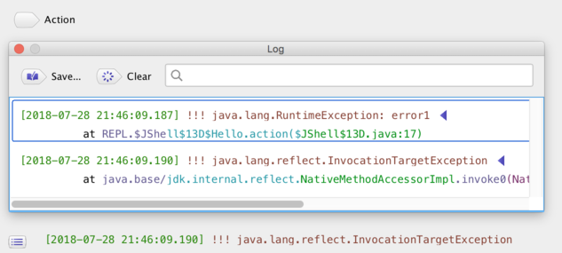

### 長時間のアクションと進捗バー

GUIアクションの実行が極端に長くなった場合、(最大カウントのない)進捗バーを表示する独立したタスクとなります。停止ボタンは割り込みを発生させるので、
[`InterruptedException`](https://docs.oracle.com/en/java/javase/11/docs/api/java.base/java/lang/InterruptedException.html) もしくは
[`Thread.interrupted()`](https://docs.oracle.com/en/java/javase/11/docs/api/java.base/java/lang/Thread.html#interrupted())で確認できます。


```java
  class Hello {
      void action() throws Exception {
          for (int i = 0; i < 100; ++i) {
              if (i % 10 == 0) System.err.println(i);
              Thread.sleep(1000);
          }
          System.err.println("finish");
      }
  }
  org.autogui.swing.AutoGuiShell.showLive(new Hello())
```

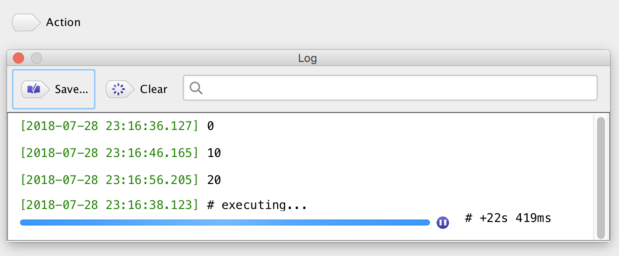

## ダークモードのサポート

現在のSwing GUI (Java23) は近年のOSの自動的なダークモードの切り替えに対応していません。

しかし、カスタムルック&フィールのライブラリを使うことでダークモードをサポートすることができます。具体的には
 [darklaf](https://github.com/weisJ/darklaf) や
[flatlaf](https://www.formdev.com/flatlaf/)があります。

本ライブラリは暗黙のうちに*flatlaf*が実行環境に含まれているかどうかをチェックし、OSの現在のテーマにあったルック&フィール(LAF)を自動的に適用します。このチェックと適用は単純に`Class.forName`を使ってリフレクションAPIにより実現しています。


例えばmacOSでは flatlaf(`com.formdev:flatlaf:3.4.1`により確認しています) と VMオプション`-Dapple.awt.application.appearance=system`によりアプリケーションを実行することで絵文字やダークモードのタイトルバーを実現したモダンなGUI体験を得ることができます。


また、LAFの設定はVMオプション`-Dautogui.laf=...`によって設定できます。
この設定の有効な値は
[UIManagerUtil.selectLookAndFeelFromSpecialName(String)](https://www.autogui.org/docs/apidocs/latest/org.autogui/org/autogui/swing/util/UIManagerUtil.html#selectLookAndFeelFromSpecialName(java.lang.String))のドキュメントを参照してください。
