# Autogui: an automatic GUI binding library

Autogui is a library for automatically creating Java/Swing GUI apps from plain-old Java objects.
It analyzes class-definitions of given objects through reflection APIs, 
and composes Swing-based components for each type of property and action defined in the classes.

## License

[Apache License v2](LICENSE.txt)


## Building from source

[GitHub Project Page](https://github.com/ppp-kohe/autogui.git)

```bash
$ git clone https://github.com/ppp-kohe/autogui.git
$ cd autogui
```

The project uses [apache-maven](http://maven.apache.org) and depends on a recent version of Java. 

* -1.1.x : Java 8 or later
* 1.2- : java 11 or later

```bash
$ mvn package
  # the command will generate target/autogui-1.2.jar
```

Note that the main part of the project does not depend on any libraries other than JDK classes. 
So you can manually compile source files placed in `src/main/java` (also `src/main/resources` for resources).

## Maven Usage

To use the library in your apaceh-maven project, you can insert the following `dependency` section into `pom.xml`.

```xml
    <dependency>
        <groupId>org.autogui</groupId>
        <artifactId>autogui</artifactId>
        <version>1.2</version>
    </dependency>
```

The library jar is available from Maven Central Repository: [org.autogui:autogui](https://search.maven.org/artifact/org.autogui/autogui/).

## API documents

* [latest](https://www.autogui.org/docs/apidocs/latest/index.html)

## Quick tutorial: A tiny example with jshell

The library can be used with `jshell` that is the official REPL-tool bundled with JDK since Java 9.
To use the library, you first need to include the jar file of the library to your class-path.
In `jshell`, you can do that by `/env -class-path <path/to/jar>`.
After launching the tool by the command `jshell`, you can paste the following code.

```
$ git clone https://github.com/ppp-kohe/autogui.git
$ cd autogui
$ mvn package
$ jshell
|  Welcome to JShell -- Version 11.0.1
|  For an introduction type: /help intro
 
jshell> 
class Hello {
   String value;
   void action() {
      System.out.println(value);
   }
}

/env -class-path target/autogui-1.2.jar

import org.autogui.swing.*
Hello h = new Hello();
AutoGuiShell.showLive(h)

```

The above code defines the class `Hello` with an instance field and a method.
After that, [`org.autogui.swing.AutoGuiShell.showLine(Object)`](https://www.autogui.org/docs/apidocs/latest/org.autogui/org/autogui/swing/AutoGuiShell.html#showLive(java.lang.Object)) starts creating a GUI window from the given object and shows the window.

The created window will contain a text field labeled as "Value" and a button on the tool-bar labeled as "Action". 
You can fill the text field with the string "hello, world" by typing the keyboard and click the button, then you will see "hello, world" on the console of `jshell`.

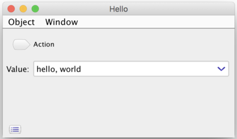

This means that the library creates the text field from the field `value`. The type of the field `String` specifies the type of the component as a text field. 
If you edit the text of the text field on the created window, the library automatically sets the value of the field of the given object `h` to the text input in the text field. This can be confirmed by `jshell> h.value`.

Also, the method `action` is bound to the action of the button on the tool-bar. If you click the button, the method will be invoked with the given object.

## Example applications

See [`src/test/java/autogui/demo`](https://github.com/ppp-kohe/autogui/tree/master/src/test/java/org/autogui/demo). 

You can execute the code in the directory, by `mvn test-compile exec:java  -Dexec.classpathScope=test -Dexec.mainClass=...`.

For example:

```bash
 mvn test-compile exec:java -Dexec.classpathScope=test \
    -Dexec.mainClass=org.autogui.demo.ImageFlipDemo
```

 `ImageFlipDemo.java` is a bit interesting and useful example:

```java
package org.autogui.demo;

import org.autogui.swing.AutoGuiShell;
import javax.imageio.ImageIO;
import java.awt.image.BufferedImage;
import java.io.File;

public class ImageFlipDemo {
    public static void main(String[] args) {
        AutoGuiShell.showLive(new ImageFlipDemo());
    }
    BufferedImage image;
    File output = new File("output.png");
    
    void flipY() {
        int w = image.getWidth();
        int h = image.getHeight();
        BufferedImage newImage = new BufferedImage(w, h, image.getType());
        for (int y = 0; y < h; ++y) {
            for (int x = 0; x < w; ++x) {
                newImage.setRGB(x, h - y - 1, image.getRGB(x, y));
            }
        }
        image = newImage;
    }
    
    void save() throws Exception {
        if (output.exists()) {
            System.err.println("File already exists: " + output);
            return;
        } else {
            ImageIO.write(image, "png", output);
        }
    }
}
```

The program will show a GUI window like the following image:

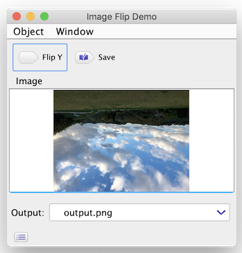

The displayed window has the following GUI components:

* The image pane *Image* created from the field `BufferedImage image` : You can drag & drop an image file to supply an input image data. The dropped image will be automatically loaded as a 
  [`BufferedImage`](https://docs.oracle.com/en/java/javase/11/docs/api/java.desktop/java/awt/image/BufferedImage.html) 
  object and displayed in the pane and assigned to the field.

* The action button *Flip Y*  created from the method `void flipY()` : After dropping an image, you can click the button to flip Y coordinate  of the image. The created `newImage` will be assigned to the `image` field. After the execution of the method, the image pane will show the flipped image.
* The file name field *Output*  created from the field `File output` : You can put the name of saving the flipped image. The field initially displays "output.png" as the initial value of the field. User input for the text field will change the field value to a new
[`File`](https://docs.oracle.com/en/java/javase/11/docs/api/java.base/java/io/File.html)   object.
* The action button *Save*  created from `void save()` : The action can write the flipped image as a new file specified by the Output field in the working directory.

## Strict mode with @GuiIncluded

To create an application that can be executed from the `main` method, 
it is reasonable to restrict GUI-aware members in the specified object.
[`@GuiIncluded`](https://www.autogui.org/docs/apidocs/latest/org.autogui/org/autogui/GuiIncluded.html) and 
[`AutGuiShell.get().showWindow(o)`](https://www.autogui.org/docs/apidocs/latest/org.autogui/org/autogui/swing/AutoGuiShell.html) satisfy the restriction.

The strict mode ...

*  can be started by [`AutoGuiShell.get().showWindow(o)`](https://www.autogui.org/docs/apidocs/latest/org.autogui/org/autogui/swing/AutoGuiShell.html#showWindow(java.lang.Object))
*  targets on[`@GuiIncluded`](https://www.autogui.org/docs/apidocs/latest/org.autogui/org/autogui/GuiIncluded.html) and `public` classes, properties and members

The following Java program is an example application with the struct mode:

```java
  import org.autogui.GuiIncluded;
  import org.autogui.swing.AutoGuiShell;
   
  @GuiIncluded
  public class Hello {
      public static void main(String[] args) {
          AutoGuiShell.get().showWindow(new Hello());
      }
       
      @GuiIncluded
      public String hello;
      
      @GuiIncluded
      public void action() {
          System.out.println(hello);
      }
       
      @GuiIncluded
      public NonIncludedType label = new NonIncludedType(); 
         //this property will be a label with the text from toString()
       
      static class NonIncludedType {
          public String toString() { return "non-included"; }
      }
  }
```

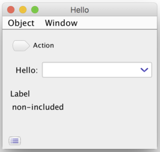

The [`showWindow`](https://www.autogui.org/docs/apidocs/latest/org.autogui/org/autogui/swing/AutoGuiShell.html#showWindow(java.lang.Object)) instance method of `AutGuiShell` restricts members to 
public ones with the annotation [`org.autogui.GuiIncluded`](https://www.autogui.org/docs/apidocs/latest/org.autogui/org/autogui/GuiIncluded.html) attached. 
With `AutoGuiShell.get().showWindow(o)`, you will need to attach the annotation to all members (classes, fields, getters, setters and actions) you want to include GUI.


## Using from modules

If your code for binding with the library is defined as a member of a module which is introduced since Java 9, you will need to open your code to the library. This is because the library relies on reflection APIs for accessing your code. In a named module, the reflection APIs are restricted to *open* members. 

The module name of the library is `org.autogui`. You will need to do the following steps in your `module-info.java` :

1. add the `open` modifier to your module declaration, or `exports` (or `opens`) your packages  ` to org.autogui;`
2. `requires org.autogui;`

```java
//your module-info.java
open module your.module { //adds the "open" modifier to the your module, or...
    exports your.pack to org.autogui; //exports your package to the library.
                                  //you can also use "opens your.pack to autogui;"
    
    requires org.autogui;   //allows your code to access the library.
    //Note that org.autogui depends on JDK's java.desktop, java.datatransfer and java.prefs
}
```

The earlier versions (-1.1) of the library was an *automatic module*, which does not contain `module-info.class` because of supporting Java 8. You can add the jar of the library to both the class-path and the module-path. But, an automatic module cannot be included in jlink's modules.

The recent versions (1.2-) have the `module-info.class` and require Java 11 or later. It can still be added to both the class-path and the module-path, and can also be assembled as a custom runtime image generated by jlink. (But the library still relies on reflection APIs, so you should carefully consider when adopting it in your practical products.)

## Supported types and components

* Basic value types
  * String text-field: 
    [`java.lang.String`](https://docs.oracle.com/en/java/javase/11/docs/api/java.base/java/lang/String.html)
  * File text-field: 
    [`java.nio.file.Path`](https://docs.oracle.com/en/java/javase/11/docs/api/java.base/java/nio/file/Path.html) or 
    [`java.io.File`](https://docs.oracle.com/en/java/javase/11/docs/api/java.base/java/io/File.html)
  * Number spinner: a primitive numeric(`byte`, `short`, `int`, `long`, `float` or `double`) or a sub-type of
    [`java.lang.Number`](https://docs.oracle.com/en/java/javase/11/docs/api/java.base/java/lang/Number.html)
  * Boolean check-box: `boolean` or 
    [`java.lang.Boolean`](https://docs.oracle.com/en/java/javase/11/docs/api/java.base/java/lang/Boolean.html)
  * Enum pull-down menu: a sub-type of 
    [`java.lang.Enum`](https://docs.oracle.com/en/java/javase/11/docs/api/java.base/java/lang/Enum.html)
  * Image pane: a sub-type of 
    [`java.awt.Image`](https://docs.oracle.com/en/java/javase/11/docs/api/java.desktop/java/awt/Image.html)
  * Document editor: 
    [`java.lang.StringBuilder`](https://docs.oracle.com/en/java/javase/11/docs/api/java.base/java/lang/StringBuilder.html) or 
    [`javax.swing.text.Document`](https://docs.oracle.com/en/java/javase/11/docs/api/java.desktop/javax/swing/text/Document.html)
  * Embedded component: a sub-type of 
    [`javax.swing.JComponent`](https://docs.oracle.com/en/java/javase/11/docs/api/java.desktop/javax/swing/JComponent.html)
* Object pane: a user-defiend object type with composition of properties and actions
  * Object properties: `T getP() {...}`, `T p() {...}` (1.2-) , `void setP(T) {...}` or `T p;`
      * if all members are other user-defined objects, then the enclosing object will be bound to a tabbed-pane
  * Action methods: `void m() {...}`
* Collection table: a sub-type of 
  [`java.util.Collection<E>`](https://docs.oracle.com/en/java/javase/11/docs/api/java.base/java/util/Collection.html)
  or an array `E[]` with columns based `E`
  * Value columns for `E`
      * String column: 
        [`java.lang.String`](https://docs.oracle.com/en/java/javase/11/docs/api/java.base/java/lang/String.html)
      * File column: 
        [`java.nio.file.Path`](https://docs.oracle.com/en/java/javase/11/docs/api/java.base/java/nio/file/Path.html) or 
        [`java.io.File`](https://docs.oracle.com/en/java/javase/11/docs/api/java.base/java/io/File.html)
      * Number column: a primitive numeric or a sub-type of 
        [`java.lang.Number`](https://docs.oracle.com/en/java/javase/11/docs/api/java.base/java/lang/Number.html)
      * Boolean column: `boolean` or 
        [`java.lang.Boolean`](https://docs.oracle.com/en/java/javase/11/docs/api/java.base/java/lang/Boolean.html)
      * Enum column: a sub-type of
        [`java.lang.Enum`](https://docs.oracle.com/en/java/javase/11/docs/api/java.base/java/lang/Enum.html)
      * Image column: a sub-type of 
        [`java.awt.Image`](https://docs.oracle.com/en/java/javase/11/docs/api/java.desktop/java/awt/Image.html)
  * A user-defined object-type composing columns from its properties and actions
  * Dynamic Collection table: a nested `Collection<Collection<E>>` or a multi-dimentional array `E[][]`

### String text-field

A property of 
[`java.lang.String`](https://docs.oracle.com/en/java/javase/11/docs/api/java.base/java/lang/String.html) 
will be bound to a text field.

```java
  class Hello {
      String prop;
  }
  org.autogui.swing.AutoGuiShell.showLive(new Hello())
```


### File text-field

A property of 
[`java.nio.file.Path`](https://docs.oracle.com/en/java/javase/11/docs/api/java.base/java/nio/file/Path.html) or 
[`java.io.File`](https://docs.oracle.com/en/java/javase/11/docs/api/java.base/java/io/File.html) 
will be bound to a text field with an extension for file operations.

```java
  import java.io.File;
  class Hello {
      File prop;  
  }
  org.autogui.swing.AutoGuiShell.showLive(new Hello())
```


### Number spinner

A property of a numerical type will be bound to a number spinner. 
Numerical types includes primitive types (`byte`, `short`, `int`, `long`, `float` and `double`) and sub-types of 
[`java.lang.Number`](https://docs.oracle.com/en/java/javase/11/docs/api/java.base/java/lang/Number.html) including 
[`java.math.BigInteger`](https://docs.oracle.com/en/java/javase/11/docs/api/java.base/java/math/BigInteger.html) and  [`java.math.BigDecimal`](https://docs.oracle.com/en/java/javase/11/docs/api/java.base/java/math/BigDecimal.html) 

```java
  class Hello {
      int prop;
  }
  org.autogui.swing.AutoGuiShell.showLive(new Hello())
```


### Boolean check-box

A property of `boolean` or 
[`java.lang.Boolean`](https://docs.oracle.com/en/java/javase/11/docs/api/java.base/java/lang/Boolean.html) 
 will be bound to a check-box.

```java
  class Hello {
      boolean prop;
  } 
  org.autogui.swing.AutoGuiShell.showLive(new Hello())
```


### Enum pull-down menu

A property of an `enum` type (a sub-type of 
[`java.lang.Enum`](https://docs.oracle.com/en/java/javase/11/docs/api/java.base/java/lang/Enum.html) 
) will be bound to a pull-down menu (non editable combo-box).
Members of the enum becomes items of the menu.

```java
  enum HelloEnum {
      Hello, World
  }
  class Hello {
      HelloEnum prop = HelloEnum.Hello;
  }
  org.autogui.swing.AutoGuiShell.showLive(new Hello())
```


### Image pane

A property of 
[`java.awt.Image`](https://docs.oracle.com/en/java/javase/11/docs/api/java.desktop/java/awt/Image.html) 
 or its sub-type will be bound to a pane for image previewing.

```java
  import java.awt.*;
  class Hello {
      Image prop;
  }
  org.autogui.swing.AutoGuiShell.showLive(new Hello())
```

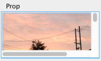

The pane supports drag & drop and zooming by the mouse wheel.
For handling images in code, 
[`java.awt.image.BufferedImage`](https://docs.oracle.com/en/java/javase/11/docs/api/java.desktop/java/awt/image/BufferedImage.html) and 
[`javax.imageio.ImageIO`](https://docs.oracle.com/en/java/javase/11/docs/api/java.desktop/javax/imageio/ImageIO.html)
are useful.

```java
  import java.io.File;
  import java.awt.image.*;
  import javax.imageio.*;
  class Hello {
      private File file;
      void setFile(File f) throws Exception {
          file = f;
          if (f != null && f.isFile()) prop = ImageIO.read(f);
      }
      File getFile() { return file; }
      BufferedImage prop;
      int getImageWidth() {
          return prop == null ? 0 : prop.getWidth();
      }
      int getImageHeight() {
          return prop == null ? 0 : prop.getHeight();
      }
  }
  org.autogui.swing.AutoGuiShell.showLive(new Hello())
```


### Document editor

A property of 
[`java.lang.StringBuilder`](https://docs.oracle.com/en/java/javase/11/docs/api/java.base/java/lang/StringBuilder.html)
or 
[`javax.swing.text.Document`](https://docs.oracle.com/en/java/javase/11/docs/api/java.desktop/javax/swing/text/Document.html) 
and its sub-type will be bound to a text-edit pane.

```java
  class Hello {
      StringBuilder prop = new StringBuilder();
  }
  org.autogui.swing.AutoGuiShell.showLive(new Hello())
```


Change of the property value will cause replacing the document of the editor. 
So the property needs to hold/return a consistent value for maintaining the editing contents by the user.

#### Advice about document properties

The text-edit pane will reflect modifications of text contents to the bound property value. 

For `StringBuilder`, it automatically creates a `Document` wrapping the builder object.
The current algorithm for modifications of the document is naive. 
So it might not be suitable for editing large sized texts.

Note that the documents and text-edit components in Swing seem to have designed as that any changes to the document must be happen within the text-edit component.
So, **the user code should not modify contents of `StringBuilder` or `Document` of the property value**. 

When the type of the property is 
[`javax.swing.text.StyledDocument`](https://docs.oracle.com/en/java/javase/11/docs/api/java.desktop/javax/swing/text/StyledDocument.html) 
, its sub-type or `StringBuiilder`, 
the user can change its (global) style by settings from the context menu.

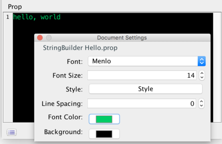

### Object pane

A property of a user-defined object class will be bound to a pane composing members of the class.

```java
  class Hello {
      String prop1;
      int prop2;
      E prop3 = new E();
      void action() {
          System.out.printf("Hello: %s %d %s\n", prop1, prop2, prop3);
      }
  }
  class E {
      String prop;
      void actionE() {
          System.out.printf("E: %s\n", prop);
      }
  }
  org.autogui.swing.AutoGuiShell.showLive(new Hello())
```

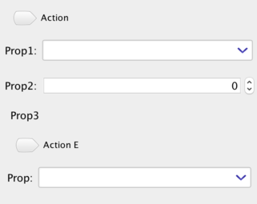

An object class can contains properties of some other object classes which will be bound to sub-panes for the objects. 

The members of the object class can include action-methods bound to tool-bar buttons.
Names of those methods does not start with `get`, `is` or `set` and does not take any arguments.

Such action-method can read and write properties of the object. If the action-method changed a property of the object, after the execution fo the method the UI automatically specifies changed property and updates the bound UI component.

#### Property definition 

A user-defined object class has properties which are bound as sub-components.
A *property* can be defiend as 1) an accessible field definition or 2) a pair of getter and setter methods. 

```java
  class Hello {
      String prop1; 
      
      private String prop2 = "hello";
      String getProp2() { return prop2; } //read-only
      
      private String prop3;
      String getProp3() { return prop3; }
      void setProp3(String p) {
          prop3 = p;
          System.err.println("updated " + prop3);
      }
      
      private boolean flag = true;
      boolean isFlag() { return flag; } //is...() for boolean
      void setFlag(boolean b) { flag = b; } 
  }
  org.autogui.swing.AutoGuiShell.showLive(new Hello())
```

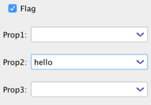

A *getter* method is a method whose name starts with `get` or `is` for booleans and which does not take any arguments with returning a value of the type of the property.

Since 1.2, the library also supports the `T prop()` method as a *getter*  like `String prop()`. This is due to supporting  [*record*](https://openjdk.java.net/jeps/359) constructs introduced since Java 14. This rule may unintentionally hide your action method that returns a non-void value and recognize it as a getter.  To back the recognition as an action method, you can use the annotation parameter [`@GuiIncluded(action=true)`](https://www.autogui.org/docs/apidocs/latest/org.autogui/org/autogui/GuiIncluded.html#action()).

A *setter* method is a method whose name starts with `set` and which takes only one argument of the type of the property value.

If a property is defined only a getter method, then the property value becomes *read-only*.

In the setter method, the user code can cause modification of some other properties.
The created UI automatically specifies changed properties of the object pane. In order to achieve the UI updateing, a getter method will be called abruptly and frequently.


#### AutoCloseable support

If a user-defined object class implements 
[`java.lang.AutoCloseable`](https://docs.oracle.com/en/java/javase/11/docs/api/java.base/java/lang/AutoCloseable.html), 
then 
[`close()`](https://docs.oracle.com/en/java/javase/11/docs/api/java.base/java/lang/AutoCloseable.html#close())
of objects of the class will be called at closing of owner window of those objects.

 (A returned window by `AutoGuiShell.showLive(o)` does not automatically call the method by window closing. Use 
[`cleanUp()`](https://www.autogui.org/docs/apidocs/latest/org.autogui/org/autogui/swing/GuiSwingWindow.html#cleanUp())
for completely closing the window.)

### Object tabbed-pane

A user-defined object which has only properties of sub user-defined objects without other value properties will be bound to a tabbed-pane. Components of each tab in the tabbed-pane become the pane created from the sub objects.

```java
  class Hello {
      Tab1 tab1 = new Tab1();
      Tab2 tab2 = new Tab2();
  }
  class Tab1 {
      String prop;
  }
  class Tab2 {
      int prop;
  }
  org.autogui.swing.AutoGuiShell.showLive(new Hello())
```

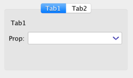


### Embedded component

A property of 
[`javax.swing.JComponent`](https://docs.oracle.com/en/java/javase/11/docs/api/java.desktop/javax/swing/JComponent.html)
or its sub-type will be bound to a pane for embedding the property value as sub-component.

```java
  import java.awt.*;
  import javax.swing.*;
  class Hello {
      private JComponent value;
      JComponent getValue() {
          if (value == null) { 
              value = new JPanel() {
                  { setPreferredSize(new Dimension(300, 300)); }
                  protected void paintComponent(Graphics g) {
                      g.setColor(Color.white);
                      g.fillRect(0, 0, getWidth(), getHeight());
                      g.setColor(Color.blue);
                      g.drawString("hello, world", 30, 30);
                  }
              };
          }
          return value;
      }
  }
  org.autogui.swing.AutoGuiShell.showLive(new Hello());
```

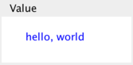

To create a user-defined UI component, you will need to follow the rule of Swing components that the code for the component must be executed within the event-dispatching thread.
And initialization of a field will be executed under a non event-dispatching thread such as the main-thread.  

Thus the user code of the property for an embedded component should be defined as *a getter method that caches the returned component as a field*. 
For a property of the embedded component, the library executes the method within the event-dispatching thread.
A returned embedded component will be added as a sub-compoennt of the owner object-pane.


#### Embedding component to your Swing applications

To embed object GUI created by the library into your Swing applications, you can use 
[`org.autogui.swing.GuiSwingRootPane.createForObject(o)`](https://www.autogui.org/docs/apidocs/latest/org.autogui/org/autogui/swing/GuiSwingRootPane.html#createForObject(java.lang.Object)).

Please see 
[`src/test/java/org/autogui/demo/ObjectEmbeddedDemo.java`](https://github.com/ppp-kohe/autogui/tree/master/src/test/java/org/autogui/demo/ObjectEmbeddedDemo.java).

To run the example:

```bash
 mvn test-compile exec:java -Dexec.classpathScope=test \
    -Dexec.mainClass=org.autogui.demo.ObjectEmbeddedDemo
```

### Collection table

A property for 
[`java.util.Collection<E>`](https://docs.oracle.com/en/java/javase/11/docs/api/java.base/java/util/Collection.html),
its sub-type or an array type `E[]`  will be bound to a table pane.
The column of the table will be created from the type-argument `E`.

```java
  import java.util.*;
  class Hello {
      List<String> prop = new ArrayList<>();
      
      void add() {
          prop.add("hello " + prop.size());
          prop = new ArrayList<>(prop); 
      }
  }
  org.autogui.swing.AutoGuiShell.showLive(new Hello())
```

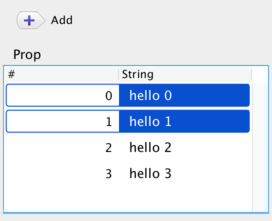

*In order to update display of the table from an action, it needs to replace instance of the list.* `prop = new ArrayList<>(prop);` is the easiest way for that.

#### Object composition in Collection table

If the type-argument`E` of `Collection<E>` is a user-defined object class, then collumns of the  table are created from properties of the class.

```java
   import java.util.*;
   class Hello {
       List<Item> prop = new ArrayList<>();
       void add() {
           prop.add(new Item("hello " + prop.size(), (int) (Math.random() * 100)));
           prop = new ArrayList<>(prop);
       }
   }
   class Item {
       String name;
       int num;
       Item(String n, int i) { this.name = n; this.num = i; }
   }
   org.autogui.swing.AutoGuiShell.showLive(new Hello())
```

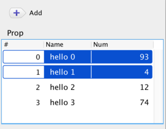

#### Actions for selected rows of Collection table

If a method of the property-owner takes the element-type `E` of  
[`java.util.List<E>`](https://docs.oracle.com/en/java/javase/11/docs/api/java.base/java/util/List.html),
then the table has a button of a tool-bar for the method. The button executes the method with a list containing objects of selected rows in the table.

If the element object in the collection has an action-method, then the table has a button of a tool-bar for the method. The button executes the method for each objects of selected rows in the table.

```java
   import java.util.*;
   class Hello {
       List<Item> prop = new ArrayList<>();
       void add() {
           prop.add(new Item("hello " + prop.size(), (int) (Math.random() * 100)));
           prop = new ArrayList<>(prop);
       }
       void remove(List<Item> selectedItems) {
           prop.removeAll(selectedItems);
           prop = new ArrayList<>(prop);
       }
   }
   class Item {
       String name;
       int num;
       Item(String n, int i) { this.name = n; this.num = i; }
       void update() { ++num; }
   }
   org.autogui.swing.AutoGuiShell.showLive(new Hello())
```

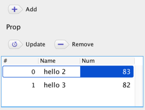

#### Managing table item selection

The created table for lists has ability to control selection of item cells.

There are two types of bindings:

* Special methods for actions of changing selected items in the table by returning a list of the items : sepcified by [`@GuiListSelectionUpdater`](https://www.autogui.org/docs/apidocs/latest/org.autogui/org/autogui/GuiListSelectionUpdater.html)
* Special methods for callbacks of user item selection from the table UI: specified by [`@GuiListSelectionCallback`](https://www.autogui.org/docs/apidocs/latest/org.autogui/org/autogui/GuiListSelectionCallback.html)

```java
import java.util.*;
import org.autogui.*;
class Hello {
    List<Item> prop = new ArrayList<>();
    void add() {
        prop.add(new Item("Hello " + prop.size()));
        prop = new ArrayList<>(prop);
    }
    @GuiListSelectionUpdater
    List<Item> selectTop() {
        return Arrays.asList(prop.get(0));
    }
    @GuiListSelectionCallback
    void selected(List<Item> items) {
        System.out.println("selected: " + items);
    }
}
class Item {
    String name;
    Item(String n) { this.name = n; }
    public String toString() { return "Item(" + this.name + ")"; }
}
org.autogui.swing.AutoGuiShell.showLive(new Hello())
```

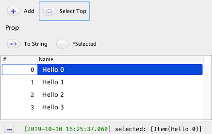

In the above example, `List<Item>selectTop()` has `@GuiListSelectionUpdater`. The method becomes the action button "Select Top" and it causes changing the selection in the table of `prop ` as selecting the top item in the list, which is returned by the method. 

And, `void selected(List<Item> items)` has `@GuiListSelectionCallback` and takes a list of items. The method also becomes the action button "*Selected", but the action of the button is automatically executed  by a selection change of the table of `prop`.

The target table of those special methods are specified by the item type, i.e. the type argument `E` of  `List<E>` . If two or more tables has the same item type of those methods, then all of the tables are affected by the methods.

As another special feature, both annotation types have the boolean argument `index`. The default value of the flag is false, and if it is specified as true, then the return or argument type of the target methods becomes  `List<Integer>` and it means the index numbers of rows instead of the item type `E`. Moreover,  `List<int[]>`  means list of {row,column}. 


### Naming rule and @GuiIncluded(name=...)

Display-names of properties, actions and type-names are generated from their identifiers with following [camelCase](https://en.wikipedia.org/wiki/Camel_case).

```java
  class Hello {
      String helloWorld; //=> "Hello World"
      String helloWORLD; //=> "Hello WORLD"
  }
```

The name can be customized by the annotation [`@GuiIncluded(name=...)`](https://www.autogui.org/docs/apidocs/latest/org.autogui/org/autogui/GuiIncluded.html#name()).

```java
  class Hello {
      @GuiIncluded(name="class") String klass;
  }
```

### Layout order by @GuiIncluded(index=...)

Order of layout of components can be controlled by  the annotation
[`@GuiIncluded(index=...)`](https://www.autogui.org/docs/apidocs/latest/org.autogui/org/autogui/GuiIncluded.html#index()). 
The default order is determined by names of the properties. 

```java
  import org.autogui.GuiIncluded;
  class Hello {
      @GuiIncluded(index=3) String prop1;
      @GuiIncluded(index=2) String prop2;
      
      private String prop3;
      @GuiIncluded(index=1) String getProp3() { return prop3; } 
      void setProp3(String p) { prop3 = p; }
  }
  org.autogui.swing.AutoGuiShell.showLive(new Hello())
```

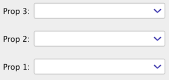

For a pair of getter and setter, one of annotations attached to the members is adopted.

### Component description by @GuiIncluded(description=...)

To display a tool-tip message for a member, you can use
[`@GuiIncluded(description=...)`](https://www.autogui.org/docs/apidocs/latest/org.autogui/org/autogui/GuiIncluded.html#description()). 


```java
   import org.autogui.GuiIncluded;
   class Hello {
       @GuiIncluded(description="component description") String prop;
   }
```

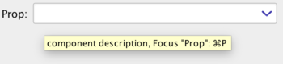

### Key binding by @GuiIncluded(keyStroke=...)

The library automatically sets shortcut keys for members based on their names.
[`@GuiIncluded(keyStroke=...)`](https://www.autogui.org/docs/apidocs/latest/org.autogui/org/autogui/GuiIncluded.html#keyStroke()) can controle binding keys. 

* `keyStroke="none"`: avoid binding
* `keyStroke="<control>... <key>"`
  * `control ::= shift | alt`
  * `key ::= A | B | C |... | Z | 0 | 1 ... | 9  `
* Reserved keys: Those keys are combined with Command (macOS) or Control.
  * `Q`: Quit, `W`: Window close
  * `shift R`: Refresh
  * `A`: Select all, `shift A`: Un-select
  * `Z`: Undo, `shift Z`: Redo
  * `O`: Open, `S`: Save
  * `X`: Cut, `C`: Copy, `V`: Paste
  * `alt O`: JSON open, `alt S`: JSON save,`alt X`: JSON cut,`alt C`: JSON copy, `alt V`: JSON paste
  * `,`: Settings

```java
   import org.autogui.GuiIncluded;
   class Hello {
       @GuiIncluded(keyStroke="L") String prop; 
       @GuiIncluded(keyStroke="T") void action() {
           System.out.println("action " + prop);
       }
       
       //automatically bound by the method name "action2", like Shift+Cmd+A
       void action2() { 
           System.out.println("action2");
       }
   }
   org.autogui.swing.AutoGuiShell.showLive(new Hello())
```
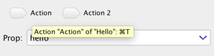

For actions, shortcut keys cause execution of the target action.
For properties, shortcut keys cause UI to focus on the target component.
Also, *Control + Enter* will display the context menu for the focusing component.

## Active Updating of UI Elements

As default, GUIs generated by the library automatically updates its display, i.e. it notices changes that requires redisplaying by accessing their properties after some actions happened.

The feature of 
[`@GuiNotifierSetter`](https://www.autogui.org/docs/apidocs/latest/org.autogui/org/autogui/GuiNotifierSetter.html)
enables you to explicitly update a specified GUI element by calling given a 
[`Runnable`](https://docs.oracle.com/en/java/javase/13/docs/api/java.base/java/lang/Runnable.html)
object. The annotation can be attached to a setter method taking a `Runnable` argument. In your code, you can call the `run()` method of the given `Runnable`  object in order to cause redisplaying of the target GUI element on demand. The target GUI element can be specified by the signature  `set<YourPropertyName>Notifier(Runnable r)`  or by using the annotation parameter `@GuiNotifierSetter(target="yourPropertyName")`.

```java
import java.util.concurrent.*;
import org.autogui.*;
import java.time.*;

class Hello implements AutoCloseable {
   private ScheduledExecutorService service;
   private ScheduledFuture<?> task;
   
   String prop;
   
   private Runnable updater;
   @GuiNotifierSetter 
   void setPropUpdater(Runnable r) { updater = r; }
   
   Hello() {
      service = Executors.newScheduledThreadPool(1);
      task = service.scheduleWithFixedDelay(this::update, 0, 3, TimeUnit.SECONDS);
   }
   private void update() {
      prop = Instant.now().toString();
      if (updater != null) {
          updater.run();
      }
   }
   public void close() {
       task.cancel(true);
       service.shutdownNow();
   }
}
org.autogui.swing.AutoGuiShell.showLive(new Hello())
```

The above example will show a text field that periodically updates its text as the current time every 3 seconds. 

The updating is done by the `update()` method; it rewrites `prop`  with the time string ( 
[`Instant.now().toString()`](https://docs.oracle.com/en/java/javase/13/docs/api/java.base/java/time/Instant.html#now()) 
) and  notifies the change of the field to the text field by explicitly calling `Runnable#run()`  to the updater set by `setPropUpdater(Runnable)`. The setter name specifies the `prop` field as the target of the updater by following the nameing rule `set<YourPropertyName>Updater`.

The constructor of the class the `update()` method will be scheduled by 
[`ScheduledExecutorService#scheduleWithFixedDelay(this::update, ...)` ](https://docs.oracle.com/en/java/javase/11/docs/api/java.base/java/util/concurrent/ScheduledExecutorService.html#scheduleWithFixedDelay(java.lang.Runnable,long,long,java.util.concurrent.TimeUnit))
method as a `ScheduledFuture` task.


## Preferences management

The created window has ability to save and reuse a set of property-values of Its binding sub-components.
This feature relies on 
[`java.util.prefs`](https://docs.oracle.com/en/java/javase/11/docs/api/java.prefs/java/util/prefs/package-summary.html).

```java
   class Hello {
       String prop;
   }
   org.autogui.swing.AutoGuiShell.showLive(new Hello())
```

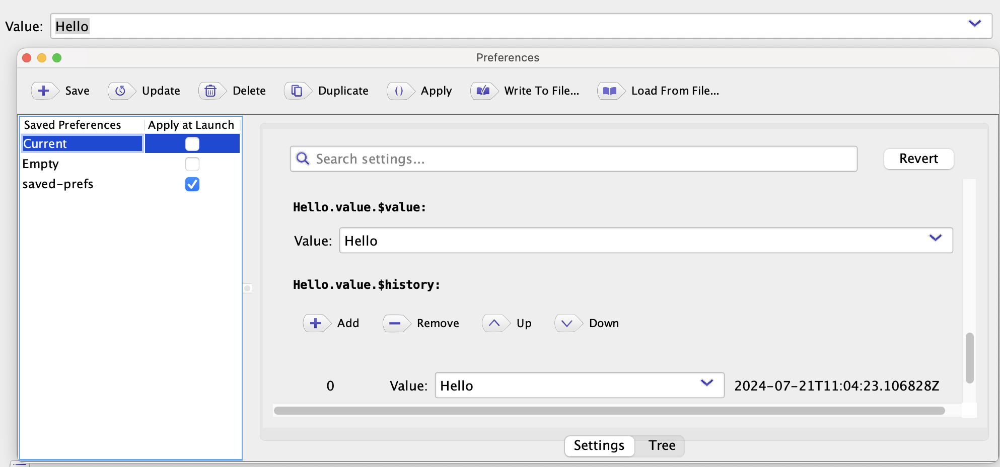

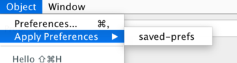

## Logging 

The created window has a status-bar and a list of displaying logging entries. An logging entry  can be one of the following types:

* String message

* Progress 

* Exception

### Logging string messages

The created window will replace 
[`System.err`](https://docs.oracle.com/en/java/javase/11/docs/api/java.base/java/lang/System.html#err) and 
[`System.out`](https://docs.oracle.com/en/java/javase/11/docs/api/java.base/java/lang/System.html#out) with redirecting its outputs to a status-view and a list-window  on the created window. 

Also, the user-code can directly show messages via 
[`GuiLogManager`](https://www.autogui.org/docs/apidocs/latest/org.autogui/org/autogui/base/log/GuiLogManager.html).

  ```java
     import org.autogui.base.log.*;
     class Hello {
         void action() {
             System.err.println("message");
             GuiLogManager.get().logString("string message");
             GuiLogManager.get().log("composed message ", 1);
             GuiLogManager.get().logFormat("format message %d", 2);
         }
     }
     org.autogui.swing.AutoGuiShell.showLive(new Hello());
  ```

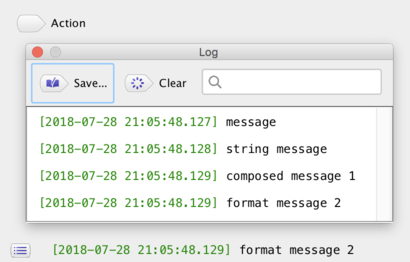

### Logging progress

[`GuiLogEntryProgress`](https://www.autogui.org/docs/apidocs/latest/org.autogui/org/autogui/base/log/GuiLogEntryProgress.html)
created by 
[`GuiLogManager`](https://www.autogui.org/docs/apidocs/latest/org.autogui/org/autogui/base/log/GuiLogManager.html)
can show and control a progress-bar.  The factory method 
[`logProgress(n)`](https://www.autogui.org/docs/apidocs/latest/org.autogui/org/autogui/base/log/GuiLogManager.html#logProgress(int))
creates an instance of the entry with the max count `n`. 
It can update the current count by 
[`addValue(i)`](https://www.autogui.org/docs/apidocs/latest/org.autogui/org/autogui/base/log/GuiLogEntryProgress.html#addValue(int)) or 
[`addValueP(p)`](https://www.autogui.org/docs/apidocs/latest/org.autogui/org/autogui/base/log/GuiLogEntryProgress.html#addValueP(double))
with taking 0...1.0. 
The progress-bar can also show a message by 
[`setMessage(s)`](https://www.autogui.org/docs/apidocs/latest/org.autogui/org/autogui/base/log/GuiLogEntryProgress.html#setMessage(java.lang.String)).

```java
     import org.autogui.base.log.*;
     class Hello {
         void action()  {
             new Thread(this::m).start();
         }
         private void m() {
             try (GuiLogEntryProgress p = GuiLogManager.get().logProgress(100)) {
                 for (int i = 0; i < 100; ++i) {
                     p.setMessage("next " + i).addValue(1);
                     Thread.sleep(1000);
                 }
             } catch (InterruptedException ie) {
                 GuiLogManager.get().logError(ie);
             }
         }
     }
     org.autogui.swing.AutoGuiShell.showLive(new Hello());
```

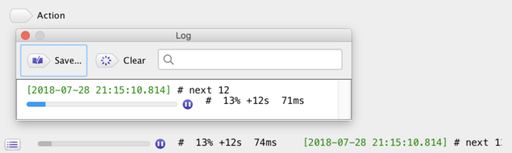

The button attached to the right side of the progress-bar causes an interruption of 
[`Thread`](https://docs.oracle.com/en/java/javase/11/docs/api/java.base/java/lang/Thread.html)
of calling `logProgress()`.  
The interruption causes an 
[`InterruptedException`](https://docs.oracle.com/en/java/javase/11/docs/api/java.base/java/lang/InterruptedException.html)
while thread-blocking caused by some APIs such as 
[`Thread.sleep(n)`](https://docs.oracle.com/en/java/javase/11/docs/api/java.base/java/lang/Thread.html#sleep(long)). 
For running code without blocking, you will need to insert
[`Thread.interrupted()`](https://docs.oracle.com/en/java/javase/11/docs/api/java.base/java/lang/Thread.html#interrupted())
in order to explicitly check the interruption.

### Logging exceptions

The created window sets an unchaught exception-handler for displaying the exception in the logging list. Also 
[`GuiLogManager.get().logError(e)`](https://www.autogui.org/docs/apidocs/latest/org.autogui/org/autogui/base/log/GuiLogManager.html#logError(java.lang.Throwable))
can explicitly display the given exception. The displayed exception becomes an item in the logging list with expandable stack-traces.

```java
   import org.autogui.base.log.*;
   class Hello {
       void action() {
           GuiLogManager.get().logError(new RuntimeException("error1"));
           throw new RuntimeException("error2");
       }
   }
   org.autogui.swing.AutoGuiShell.showLive(new Hello());
```

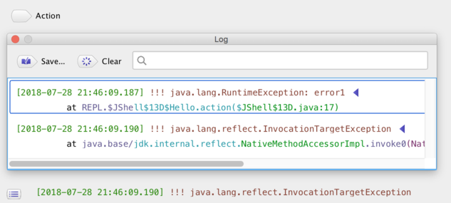

### Long running action and progress-bars	

A long running action will be an independent task with displaying an indeterminate progress-bar. The stop button can cause an interrupution resulting in 
[`InterruptedException`](https://docs.oracle.com/en/java/javase/11/docs/api/java.base/java/lang/InterruptedException.html) or 
[`Thread.interrupted()`](https://docs.oracle.com/en/java/javase/11/docs/api/java.base/java/lang/Thread.html#interrupted()). 

```java
  class Hello {
      void action() throws Exception {
          for (int i = 0; i < 100; ++i) {
              if (i % 10 == 0) System.err.println(i);
              Thread.sleep(1000);
          }
          System.err.println("finish");
      }
  }
  org.autogui.swing.AutoGuiShell.showLive(new Hello())
```

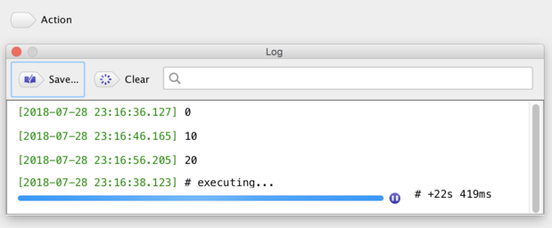
